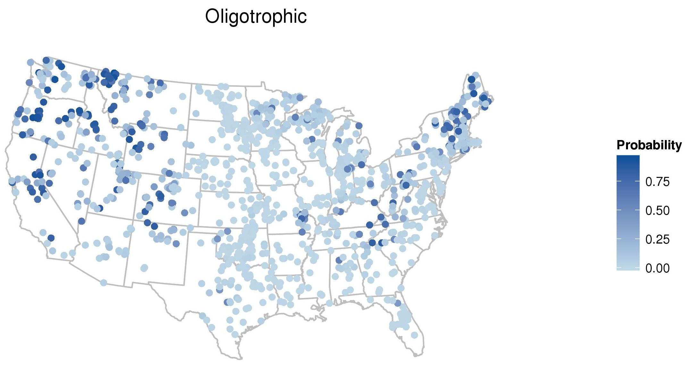
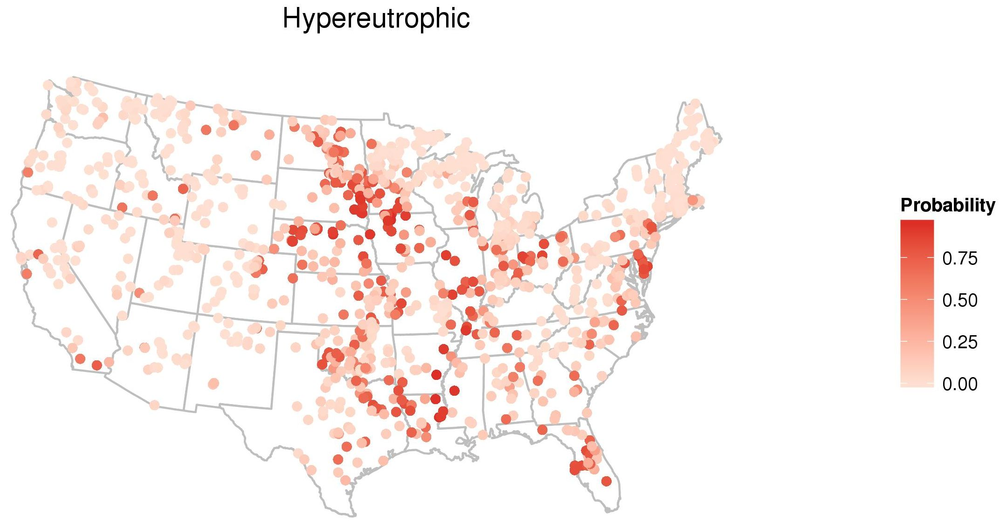

#Predicting indices of cyanobacteria toxicity and bloom risks in lakes based on nutrient inputs and ecosystem attributes

#Table Of Contents:

1. [Executive Summary](#executive-summary)
2. [A random forest approach for predicting chlorophyll *a* in U.S. lakes](#a-random-forest-approach-for-predicting-chlorophyll-a-in-us-lakes)
3. [Additional Efforts](#additional-efforts)
4. [Related Products](#related-products)
    - [Presentations and Posters](#presentations-and-posters)
    - [Blog Posts](#blog-posts)
    - [Scientific Software](#scientific-software)
    - [Scientific Communications](#scientific-communications)
5. [Contributors](#contributors)
    - [Betty J. Kreakie](#betty-kreakie)
    - [Jeffrey W. Hollister](#jeff-hollister)
    - [W. Bryan Milstead](#bryan-milstead)
    - [Farnaz Nojavan](#farnaz-nojavan)
6. [EPA Disclaimer](#epa-disclaimer)
7. [PDF Version](predicting_inidices.pdf)

#Executive Summary: 
Despite a lengthy history of research on cyanobacteria, many important questions about this diverse group of aquatic, photosynthetic “blue-green algae” remain unanswered. For example, how can we more accurately predict cyanobacteria blooms in freshwater systems? Which lakes have elevated risks for such blooms? What characteristics mark areas with high risks for cyanobacteria blooms? These are important questions, and our work is an attempt to move us closer to finding answers to some of them.

There are numerous viable modes of research that can be applied to cyanobacteria research. Our research specifically follows a computational ecology research mode that is heavily entrenched in an ethos of open science. More explicitly, our approaches tend to be computationally-demanding and based on machine-learning approaches. We rely on large (both in size and spatial extent) data sets to extract information about water quality and related indicators. Additionally, all aspects of our research are open and freely available to the public, including our data, code, and final formalized products.

Using these approaches, we have developed two random forest models to predict chlorophyll a in lakes samples as part of the 2007 National Lakes Assessment. Additionally, we predict the trophic state for lakes based on universally available data alone (e.g. National Land Cover Data Base, Lake Morphometry, etc.) and universally available data in combination with in situ water quality measures from the National Lake Assessment. When the full model (referred to as the "All variables" model) is used, we explained ~80% of the variation. This dropped to ~50% when only the universally available data were included (the "GIS only" model). The classification accuracy for these models as applied to various trophic state classifications ranged from 49% to 87%. One of the most important findings is that the models built with universally available data have a very broad range of possible applications. They may be used to predict trophic state for nearly all lakes in the United States and, most importantly, provide a measure of the uncertainty around those predictions. This lets us highlight lakes where we are very confident in the current trophic state, as well as lakes in which we are less confident and which may require additional sampling. Furthermore, because of a known association between higher trophic states and the presence of cyanobacteria, the probability of a lake being hypereutrophic provides insights into the likelihood of cyanobacteria presence.

*Note: This website presents the collective works conducted for Safe and Sustainable Water Resources (SSWR) 2.3c. Additionally, this website is intended to be the SSWR 2.3C1 Annual Performance Reporting (APR) product: “Report on approaches to predicting probability of cyanobacteria blooms or related indices based on nutrient inputs and other ecosystem attributes in lakes.” Planning of this product began in 2011. At that time it was expected that this product would focus on toxicity and abundance; however, as work began it was quickly evident that this focus was not feasible with the available data. The title of the product was changed to reflect this reality. The work presented here focus on indices of cyanobacteria instead.*

#A random forest approach for predicting chlorophyll *a* in U.S. lakes

##Introduction

Cyanobacteria are a group of aquatic photosynthetic bacteria. This group is commonly referred to as “blue-green algae” based on its general bluish green color. However, cyanobacteria are taxonomically prokaryotes and not directly related to eukaryotic algae. Cyanobacteria can be found in almost every habitat type on earth. Their success can be attributed to several factors. First, they are photosynthetic, thus allowing them to produce their own food. Of equal importance are special adaptations that allow cyanobacteria to live in low nutrient conditions. For example, many species are able to fix atmospheric nitrogen, a nutrient that is often limiting. Others can adjust their relative buoyancy allowing them to move up or down in the water column to harvest nutrients from the sediments and the hypolimnion (deep waters); this allows them to outcompete other photosynthetic plankton when nutrients are limiting. Cyanobacteria presence in the environment is typically not an issue of concern; however, in optimal conditions cyanobacteria can dramatically increase in abundance resulting in a bloom.

These blooms can lead to reduced water clarity, diminished aesthetic appeal, and sometimes hypoxia. Many species can also produce toxins, which can have effects ranging from mild discomfort to sickness in humans and sometimes death in other animal populations. So,

cyanobacteria blooms can have a number of undesirable consequences from ecological, economic, and human health perspectives.

In the summer of 2014, the economic and social consequences of cyanobacteria blooms were evident during a bloom in Lake Erie that closed the drinking water supply for the city of Toledo, OH (Link). In short, a better understanding of the water quality and landscape factors that increase the probability of these types of harmful algal blooms (HABs) will provide water resource managers targets for mitigation so that the resources under their control are less likely to suffer from future HABs and associated negative consequences.

Attaining understanding will require a variety of scientific and modelling approaches. In our current research, we are exploring modeling methods (e.g. random forests, Bayesian hierarchical model, etc.) and approaches (e.g. Open Science) not widely used in cyanobacteria modelling work. It is this combination of modelling and scientific approaches that will allow this work to make strides towards a goal of US EPA ORD research to link ecological endpoints to human health and wellbeing.

To understand and anticipate bloom events, we would ideally like to directly model and predict cyanobacteria dominance in a lake. There are several technical issues why this is not currently possible, at least not at the continental scale. Much of this work is based on the 2007 National Lakes Assessment, a comprehensive survey US (lower 48 only) lakes. During the 2007 survey, cyanobacteria were identified and counted. As a result, abundances can be calculated by taxon and these can be summed to get total counts per lake. However, phytoplankton cell sizes are highly variable both among and within species. To gain insight into how and when blooms occur we need to convert counts into biomass (or biovolume) and this is not possible without estimates of average cell size. The 2012 National Lake Assessment may have resolved this limitation, but the data are not yet available. For now, we have been able to successfully use chlorophyll a concentration as a proxy for cyanobacteria abundance.

The concentration of chlorophyll a is a measure of the biological productivity of a lake and is largely (but not exclusively) determined by available nutrients. As nutrient inputs increase, productivity increases and lakes transition from a lower trophic state (e.g., oligotrophic) with low chlorophyll a concentrations to higher trophic states (e.g., eutrophic) with greater chlorophyll a concentrations. These broad trophic state classifications are good predictors of ecosystem health and the potential for ecosystem services/disservices (e.g. recreation, aesthetics, fisheries, and harmful algal blooms) and may be used as an indicator. Thus, a common goal of lake managers is to control the factors that drive chlorophyll a and, ultimately, trophic state. Typically, nutrient levels alone have been used to model chlorophyll a and trophic state; however, direct measures of water quality are limited in ability to predict the status of unsampled lakes. The surrounding landscape structure may also impact chlorophyll a concentration and could be used to improve predictions over a larger spatial extent. Our current research is focused on developing models that predict trophic state (derived from chlorophyll a), and then eventually cyanobacteria abundance.

##General Methods

###Data:

Modelling lakes across broad regions requires synthesis of data from a variety of sources. For these efforts we used the 2007 National Lakes Assessment (NLA) for directly sampled chlorophyll a and other measured water quality variables. We also used derived variables such as growing degree days, National Land Cover Dataset (NLCD), and lake morphometry. We have also assisted with the collection and have made use of data that collected by citizen scientists. Our research going forward will rely more heavily on these underused data sources.

###Predicting Trophic State with Random Forests:

Random forest, a machine learning algorithm, makes a prediction based on numerous decision or regression trees. Both the sample data and predictor variables are randomly selected for each tree. To ease interpretation of the final models, we used a variable selection algorithm to pare down the total number of variables into a reduced model. The final random forest is calculated from the reduced model.

We did this for two combinations of variables: “All Variables” (in situ water quality and GIS variables) or “GIS Only” variables (i.e. no in situ information). For each set of variables, we determined the consensus prediction for chlorophyll a and converted those predictions into four and two trophic state classes (Table 1). For these predicted classifications we calculated a confusion matrix and summary statistics. Using these classes, we estimated the probability that each lake is in a given trophic state.

|Trophic State (4 Class)|Trophic State (2 Class)|Concentration Cut-off|
|:----------------------|:----------------------|:--------------------|
|Oligotrophic           |Oligo-/Mesotrophic     |<= 2 µg/l            |
|Mesotrophic            |Oligo-/Mesotrophic     |> 2 – 7 µg/l         |
|Eutrophic              |Eu-/Hypereutrophic     |> 7 – 30 µg/l        |
|Hypereutrophic         |Eu-/Hypereutrophic     |> 30 µg/l            |

**Table 1. Trophic state classes and chlorophyll a cut-off concentrations**

##Results

The “All Variables” model had an RMSE of 0.09 and R2 of 0.8; whereas, the “GIS Only” model was 0.22 and 0.48 for RMSE and R2, respectively. The classification results are summarized in Table 2.

|Model                            |Total Accuracy |Kappa|
|:--------------------------------|:--------------|:----|
|All Variables – 4 Trophic States |69%            |0.57 |
|All Variables – 2 Trophic States |87%            |0.75 |
|GIS Variables – 4 Trophic States |49%            |0.29 |
|GIS Variables – 2 Trophic States |75%            |0.50 |

**Table 2. Summary of model classification accuracy**

Examining the “GIS Only” model (i.e., the model that has broadest applicability) we see that in spite of lower overall accuracy, it still has better than even odds (i.e., prediction probability is > 50%) of being correct in more than 1091 of the 1138 lakes included in this model. The “GIS Only” model has tremendous potential for use across the country. This potential exists because the datasets required to parameterize the model are ubiquitous. More importantly though, a prediction of the probability that a lake is in a given class provides an estimate of the uncertainty around that prediction. For example, we can map the probability that any of the 1138 lakes in the “GIS Only” model is oligotrophic (Figure 1) or hypereutrophic (Figure 2). These probabilities provide a strong indicator of the presence of cyanobacteria.

**Figure 1. Probability of lake being oligotrophic**

**Figure 2. Probability of lake being hypereutrophic**

##Summary

Data collected by the EPA and States through the National Lakes Assessment has provided a unique and important glimpse of lake water quality across the nation. Combining this data with other data sets and applying data mining techniques allows us to ask and answer some interesting questions related to indices of cyanobacteria. As expected, in situ water quality measures provide the best predictions (model R2 ~ 0.8), but those models are limited in their application as they require detailed data that are not available for a large number of lakes. Using ubiquitous GIS data to build a model results in a poorer fit (model R2 ~ 0.5). Yet using these models to predict trophic state classification results in accurate predictions 75% of the time, are applicable across the country, and have estimates of the uncertainty of those predictions and have potential for use as indicators of cyanobacteria presence. Thus, the “GIS Only” models are an approach that could have a broad range of applications.

#Additional Efforts

Our currently implemented random forest models are useful for a wide range of activities, yet we plan to continue exploring additional approaches for predicting indices of cyanobacteria bloom probability. First, we are looking at using other indices of cyanobacteria blooms. In particular are cyanobacteria abundance, cyanobacteria biovolume, and microcystin (a cyanotoxin) presence or absence. In addition to exploring the use of other modelling endpoints, we are also looking at hierarchical Bayesian models. A major benefit of Bayesian models is that they allow us to

update existing models with new information, something not possible with our current models. This is an especially appealing approach when using the National Lakes Assessment as the models can be updated and improved as new data come in every five years. These efforts are currently ongoing.

#Related Products

In the sections below we outline the products and communications that deal directly with the various approaches we have used to predict probability of cyanobacteria blooms and related indices.

##Presentations and Posters

- Hollister, Milstead, Kreakie. Expanding Models of Lake Trophic State to Predict Cyanobacteria in Lakes: A Data Mining Approach. 99th Annual Ecological Society of America Annual Meeting, Sacramento, CA. August 2014. [Poster](http://f1000research.com/posters/1096851)

- Kreakie, Nojavan, Hollister (2014) When Green Goes Bad: A Computational Ecology Approach to a Better Understanding of Cyanobacteria, Nutrients, and Lakes. US EPA Office of Wetlands, Oceans, and Watersheds (OWOW) Cyanobacteria webinar series. [Slides](http://cfpub.epa.gov/si/si_public_file_download.cfm?p_download_id=520712)

- Kreakie, Milstead, Hollister (2014) When Green Goes Bad: An Interdisciplinary Approach to Better Understand Cyanobacteria, Nutrients, and Lakes. US EPA Safe and Sustainable Waters Research program Webinar Series. [Abstract](http://cfpub.epa.gov/si/si_public_record_report.cfm?dirEntryId=282620&keyword=&actType=&TIMSType=+&TIMSSubTypeID=&DEID=&epaNumber=&ntisID=&archiveStatus=Both&ombCat=Any&dateBeginCreated=&dateEndCreated=&dateBeginPublishedPresented=&dateEndPublishedPresented=&dateBeginUpdated=&dateEndUpdated=&dateBeginCompleted=&dateEndCompleted=&personID=74607&role=Any&journalID=&publisherID=&sortBy=title&count=25&CFID=40937551&CFTOKEN=84624132)

- Kreakie, Milstead, Hollister (2014) Combined Influence of Landscape Composition and Nutrient Inputs on Lake Trophic Structure. US Chapter of the International Association for Landscape Ecology Annual Meeting. Anchorage, AK.[Abstract](http://cfpub.epa.gov/si/si_public_record_report.cfm?dirEntryId=279535&keyword=&actType=&TIMSType=+&TIMSSubTypeID=&DEID=&epaNumber=&ntisID=&archiveStatus=Both&ombCat=Any&dateBeginCreated=&dateEndCreated=&dateBeginPublishedPresented=&dateEndPublishedPresented=&dateBeginUpdated=&dateEndUpdated=&dateBeginCompleted=&dateEndCompleted=&personID=74607&role=Any&journalID=&publisherID=&sortBy=title&count=25&CFID=40937551&CFTOKEN=84624132)

- Nojavan, F., B. J. Kreakie. A Bayesian Multilevel Model for Microcystin Prediction in the Continental United States Lakes. 2015 Society for Freshwater Science (SFS) Annual Meeting, Milwaukee, WI May 2015. [Abstract](http://cfpub.epa.gov/si/si_public_record_report.cfm?dirEntryId=308374&keyword=&actType=&TIMSType=+&TIMSSubTypeID=&DEID=&epaNumber=&ntisID=&archiveStatus=Both&ombCat=Any&dateBeginCreated=&dateEndCreated=&dateBeginPublishedPresented=&dateEndPublishedPresented=&dateBeginUpdated=&dateEndUpdated=&dateBeginCompleted=&dateEndCompleted=&personID=74607&role=Any&journalID=&publisherID=&sortBy=title&count=25&CFID=40937551&CFTOKEN=84624132)

##Blog Posts

- Hollister, Kreakie, Milstead. (2014). Opening our Science: Open Science and Cyanobacterial Research at EPA. US EPA It All Starts with Science Blog. [Blog Post](https://blog.epa.gov/blog/2014/06/open-science-and-cyanobacterial-research-at-epa/)

- Kreakie, Hollister, Milstead (2014). Modeling Cyanobacteria Ecology to Keep Harmful Algal Blooms at Bay. US EPA It All Starts with Science Blog. [Blog Post](https://blog.epa.gov/blog/2014/06/modeling-cyanobacteria-ecology-to-keep-harmful-algal-blooms-at-bay/)

- Hollister, Milstead. (2013). SPARROWs, Lakes, and Nutrients? US EPA It All Starts with Science Blog. [Blog Post](https://blog.epa.gov/blog/2013/12/sparrows-lakes-and-nutrients/?utm_source=rss&utm_medium=rss&utm_campaign=sparrows-lakes-and-nutrients)

##Scientific Software

- Hollister, Milstead, Kreakie (2015). LakeTrophicModelling. [Repository](https://github.com/USEPA/LakeTrophicModelling)

- Hollister (2014). lakemorpho: Lake morphometry in R. V1.0. 10.5281/zenodo.16244. [Repository](https://github.com/USEPA/lakemorpho)

##Scientific Communications

- Hollister, Milstead, and Kreakie (In Review). Modeling Lake Trophic State: A Data Mining Approach. Submitted to Ecosphere. [Peerj Pre-print](https://peerj.com/preprints/1319/)

- Kreakie, Hollister, Milstead. (2015). Computational Ecology for Managing Cyanobacteria in Lakes. LakeLines Magazine. [PDF](http://www.nalms.org/media.acux/beb75c9c-f812-4753-b888-79864899c6d6)

- Milstead, Hollister, Moore, Walker. (2013). Estimating Summer Nutrient Concentrations in Northeastern Lakes from SPARROW Load Predictions and Modeled Hydraulic Residence Time. PLoS ONE 8(11). [Link](http://journals.plos.org/plosone/article?id=10.1371/journal.pone.0081457)

#Contributors

##Betty Kreakie

Betty Kreakie, Ph.D., is a research ecologist for the US Environmental Protection Agency’s Office of Research and Development in Narragansett, Rhode Island. Betty earned her PhD in integrative biology from the University of Texas at Austin, and a Master’s in conservation science/spatial statistics from Duke University’s Nicholas School of the Environment. Her work focuses on the development of spatially explicit, landscape level models that predict how biological populations and communities will respond to anthropogenic influences such as nutrient and contaminant inputs, climate change, and habitat conversion.

##Jeff Hollister

Jeff Hollister is a landscape ecologist with expertise in the spatial component of ecology and environmental sciences. He holds a Bachelor’s degree in Biology from Baker University, a Master’s Degree in Resource Ecology from Duke University, and a Ph. D. in Environmental Science from the University of Rhode Island. Since, May of 2006, he has worked as a Research Ecologist with the US EPA’s Atlantic Ecology Division in Narragansett, RI. His current research focus is on how nutrients drive risk of cyanobacterial blooms in lakes and ponds. A unifying theme to his research is using Open Science (Open Access, Open Source, and Open Data) to benefit environmental science.

##Bryan Milstead

Bryan Milstead is a research ecologist with the US Environmental Protection Agency in Narragansett RI (a long way from his birthplace in Alpine Texas). Before joining the US EPA he worked for the US National Park Service, the Charles Darwin Foundation for the Galapagos Islands, and Northern Illinois University. He has a B.S. from Southwest Missouri State in entomology, a M.S. from the University of Oklahoma in aquatic ecology, and Ph.D. from Northern Illinois University in small mammal ecology. Bryan has worked extensively throughout South and North America and the Caribbean on varied research projects involving a dazzling variety of habitats and organisms. The one theme that holds all his work together is a strong interest in quantitative analysis and data management. He uses the open source R programming environment for most of his work in modeling, statistics, data manipulation, GIS, and graphics. When not sitting in front of a computer, Bryan spends his time, enjoying the company of his family, practicing and teaching yoga, sailing, gardening, and taking care of his ancient dachshund.

##Farnaz Nojavan

Farnaz Nojavan is an Oak Ridge Institute for Science and Education (ORISE) Postdoctoral Fellow, at the US EPA Atlantic Ecology Division. She is broadly interested in ecological modeling, aquatic ecosystems, Bayesian statistics, risk assessment, and environmental decision analysis. A central theme in her interdisciplinary research is the use of Bayesian statistics to improve inference and prediction. Her current research draws upon Bayesian multilevel modeling and datasets from disparate sources to investigate cyanobacteria distribution, microcystin risk, and changes in the algal community in lakes of the continental United States.

#EPA Disclaimer
The United States Environmental Protection Agency (EPA) GitHub project code is provided on an "as is" basis and the user assumes responsibility for its use.  EPA has relinquished control of the information and no longer has responsibility to protect the integrity , confidentiality, or availability of the information.  Any reference to specific commercial products, processes, or services by service mark, trademark, manufacturer, or otherwise, does not constitute or imply their endorsement, recommendation or favoring by EPA.  The EPA seal and logo shall not be used in any manner to imply endorsement of any commercial product or activity by EPA or the United States Government.  This contribution is identified by the tracking number ORD-013340 of the Atlantic Ecology Division, Office of Research and Development, National Health and Environmental Effects Research Laboratory, US Environmental Protection Agency.

